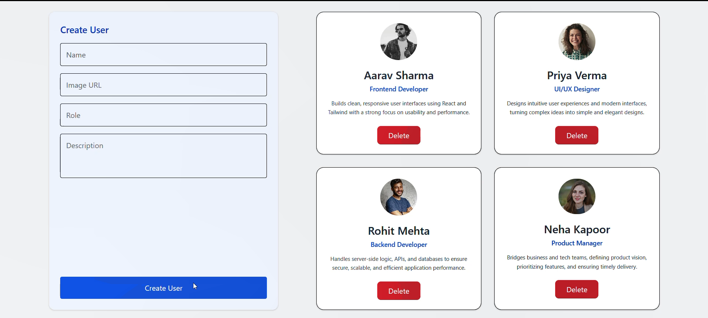

# Day 75 Task | Cohort 2.0

This repository contains the work completed as part of **Day 75** in **Sheryians Coding School Cohort 2.0**.  
The focus of this task was to build a **User Management interface using React**, with emphasis on form handling, state management, and clean card-based UI design.

## 🖼️ Project Overview

The application provides a simple and intuitive interface where users can:
- Add user details through a form
- View the added users as cards in real time
- Remove users dynamically

The layout follows a **side-by-side structure**, with the form on the left and user cards displayed on the right for better clarity and usability.

## 🧩 Features Implemented

| Feature | Description |
|------|-------------|
| 📝 User Form | Collects user details such as name, image URL, role, and description |
| 🪪 User Cards | Displays users in a clean, centered, card-based layout |
| 🔄 State Management | React `useState` used to manage form inputs and user data |
| ➕ Add Users | New users added dynamically on form submission |
| ❌ Delete Users | Users can be removed using a delete button |
| 🧹 Auto Reset | Form fields reset automatically after submission |
| 📐 Structured Layout | Form and cards placed side by side using Flexbox and Grid |
| 🔁 Dynamic Rendering | Cards rendered dynamically using `.map()` |

## ✨ Key Learning Highlights

Through this task, I learned to:
- Handle multiple controlled form inputs in React
- Update and manage arrays in state efficiently
- Use component-based architecture for better code organization
- Pass functions as props for child-to-parent communication
- Build a clean and user-friendly UI using Tailwind CSS

## 🛠️ Technologies Used

- JavaScript (ES6+)  
- React.js  
- Tailwind CSS  
- HTML5  

## 📖 Learning Outcome

By completing Day 75, I gained a stronger understanding of:
- React form handling and state updates  
- Dynamic rendering of components  
- Component reusability and props usage  
- Building structured and maintainable frontend layouts  

## 🌟 Acknowledgement

This task was completed as part of **Sheryians Coding School – Cohort 2.0**.

---
